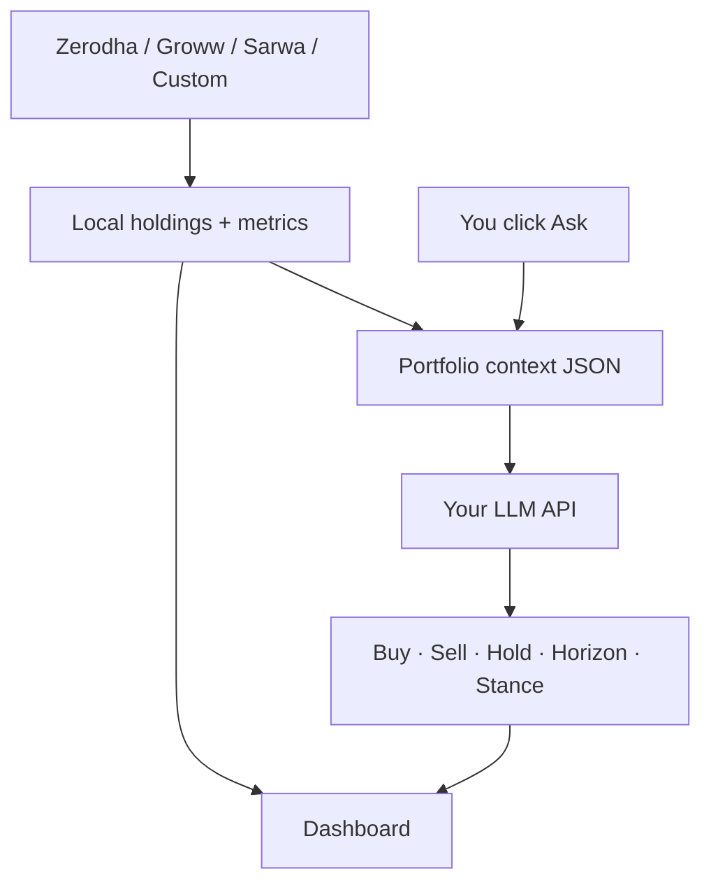

<p align="center">
  <strong>Talk to My Portfolio</strong><br>
  <sub>See every holding in one place — then <em>ask</em> what to buy, sell, trim, or hold.</sub>
</p>

<p align="center">
  <a href="https://github.com/ab9bhatia/talk-to-my-portfolio">GitHub</a>
  ·
  <a href="#talk-to-your-portfolio">Portfolio agent</a>
  ·
  <a href="docs/broker-api-keys.md">Broker setup</a>
  ·
  <a href="#quick-start">Quick start</a>
</p>

<p align="center">
  
  
  
</p>

---

## Why this exists

Indian families often hold stocks and funds across **Zerodha**, **Groww**, **Sarwa**, and offline sheets — but decisions still happen in fragments: one app for prices, another for news, gut feel for trim vs hold.

**Talk to My Portfolio** is built around a simple idea: **consolidate first, then converse**. You get a unified dashboard *and* an integrated **portfolio agent** that reads your real holdings (sector, industry, signals, concentration) and answers in plain language — what to add, what to trim, what to watch, and how long to hold.

Everything runs **on your machine**. Broker data stays local; only the questions you explicitly send to the agent use your configured LLM API key.

---

## Talk to your portfolio

The agent is **built into the dashboard**, not a separate product. After your brokers are linked, open the **Portfolio agent** panel on [`/portfolio`](http://127.0.0.1:8000/portfolio), ask a question, and get a structured advisory reply streamed in real time.

### What it helps with

| Area | Examples |
|------|----------|
| **Buy / add** | Which names to initiate, add to, or watch — with rationale |
| **Sell / trim** | Overweight positions, trim vs exit, concentration risks |
| **Hold horizon** | Time horizon guidance per idea (e.g. 3y+ core holdings) |
| **Portfolio view** | Overall stance, XIRR outlook vs your goals, macro read |
| **Themes** | Sector/theme opportunities aligned to your actual book |
| **Red flags** | Governance, concentration, or mix issues surfaced from context |
| **Follow-ups** | Multi-turn chat — “what if I drop X and add Y?” |

It uses **your** JSON context: live holdings, sector/industry labels, business summaries, deterministic flags, and dashboard signals (e.g. upside where available) — not ticker guesswork.

### Example questions

- *Should I trim banking and add to infrastructure themes?*
- *Which holdings are weakest vs my 15% return goal?*
- *What would you exit in the next rebalance given current weights?*
- *Any red flags in my top ten positions by value?*

### How it works (privacy-first)



- **No LLM calls on page load** — only when you click **Ask** (or send a follow-up).
- **Threaded chats** — sessions saved locally for continuity.
- **Not financial advice** — personal decision support using data you already trust; you stay in control of every trade.

Enable with `OPENAI_API_KEY` (or `PORTFOLIO_OPENAI_API_KEY`) in `.env`. See [Enable the agent](#enable-the-agent).

---

## What else is included

| | |
|---|---|
| **Unified dashboard** | Family P&amp;L, filters by account, sector, cap bucket, 52W, upside, signals |
| **Account hub** | Add, edit, reconnect brokers; import CSV / Excel / screenshots |
| **Brokers** | Zerodha (Kite), Groww (Trade API), Sarwa (USD), Custom portfolios |
| **Smart cache** | Stale-first SQLite + background refresh |
| **Daily growth** | Auto-saved each live refresh; charts on **Growth** tab |
| **Weekly history** | Weekly snapshots + Excel export in `portfolio_history.db` |
| **Optional trading** | Live Buy/Sell when `TRADING_ENABLED=true` |

---

## Screens & routes

| Route | Purpose |
|-------|---------|
| [`/portfolio`](http://127.0.0.1:8000/portfolio) | Dashboard + **Portfolio agent** |
| [`/portfolio/growth`](http://127.0.0.1:8000/portfolio/growth) | **Daily growth** — value trend & day-over-day by account / cap |
| [`/portfolio/setup`](http://127.0.0.1:8000/portfolio/setup) | Connect & edit accounts |
| [`/docs`](http://127.0.0.1:8000/docs) | Swagger API |
| `POST /api/portfolio/agent/ask` | Agent (SSE stream) |

---

## Quick start

```bash
git clone https://github.com/ab9bhatia/talk-to-my-portfolio.git
cd talk-to-my-portfolio

python3 -m venv .venv
source .venv/bin/activate
pip install -r requirements.txt

bash scripts/init_local_config.sh
uvicorn main:app --reload --host 127.0.0.1 --port 8000
```

1. **[Connect accounts](http://127.0.0.1:8000/portfolio/setup)** — Zerodha, Groww, or custom import  
2. **[Portfolio](http://127.0.0.1:8000/portfolio)** — review holdings, scroll to **Portfolio agent**, ask your first question  

---

## Configure brokers

Two gitignored files must share the same account `"id"`:

| File | Role |
|------|------|
| `modules/portfolio/accounts.json` | Who — labels, codes (`AB`, `HB`), enabled |
| `.env` | Secrets — `ZERODHA_API_KEY_<ID>`, `GROWW_*`, etc. |

`"id": "primary"` → `ZERODHA_API_KEY_PRIMARY`, …

<details>
<summary><strong>Zerodha, Groww, Sarwa, Custom</strong> — setup steps</summary>

- **Zerodha** — [developers.kite.trade](https://developers.kite.trade/), redirect `http://127.0.0.1:8000/auth/zerodha/callback`, then **Connect** on the dashboard  
- **Groww** — [groww.in/trade-api](https://groww.in/trade-api), TOTP or API keys in `.env`  
- **Sarwa / Custom** — weekly or file import via **Connect accounts**  

Full guide: **[docs/broker-api-keys.md](docs/broker-api-keys.md)**

</details>

---

## Enable the agent

Add to `.env`:

```text
OPENAI_API_KEY=sk-...
# optional:
PORTFOLIO_LLM_MODEL=gpt-4o-mini
```

The agent is the **primary** OpenAI use case. Other LLM features are separate and off by default:

| Feature | When it runs | Default |
|---------|----------------|---------|
| **Portfolio agent** | You click **Ask** | On once key is set |
| Sarwa / screenshot import | File upload | Needs same key |
| Sector / buy thesis on refresh | `?refresh=1` | Off |

---

## Project layout

```text
talk-to-my-portfolio/
├── main.py
├── modules/portfolio/services/
│   ├── portfolio_agent.py    # talk-to-your-portfolio brain
│   ├── portfolio_context.py  # holdings → agent context
│   └── portfolio.py          # broker fetch + cache
├── shared/web/               # dashboard + agent UI
└── docs/
```

---

## Requirements

- Python 3.11+, macOS or Linux  
- Zerodha Kite app(s) per login  
- Groww Trade API (optional)  
- **OpenAI API key** — to use the portfolio agent (and optional screenshot import)

---

## Security

- Never commit `.env`, `accounts.json`, or `modules/portfolio/data/`  
- Agent sends **portfolio context + your question** to your chosen LLM provider when you ask — nothing automatic in the background  
- Prefer a private GitHub repo for personal forks  

---

## API snapshot

| Method | Path | Description |
|--------|------|-------------|
| `GET` | `/portfolio` | Dashboard + agent UI |
| `POST` | `/api/portfolio/agent/ask` | Stream advisory JSON (SSE) |
| `GET` | `/api/portfolio` | Family holdings JSON |

---

## Publish

```bash
git remote add origin https://github.com/YOUR_USER/talk-to-my-portfolio.git
git push -u origin main
```

**[github.com/ab9bhatia/talk-to-my-portfolio](https://github.com/ab9bhatia/talk-to-my-portfolio)**

---

## License

MIT — add a `LICENSE` file if you open-source.
