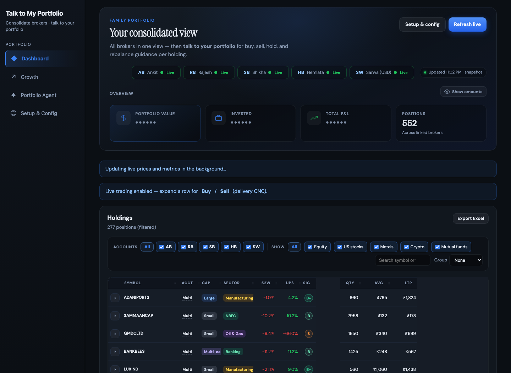
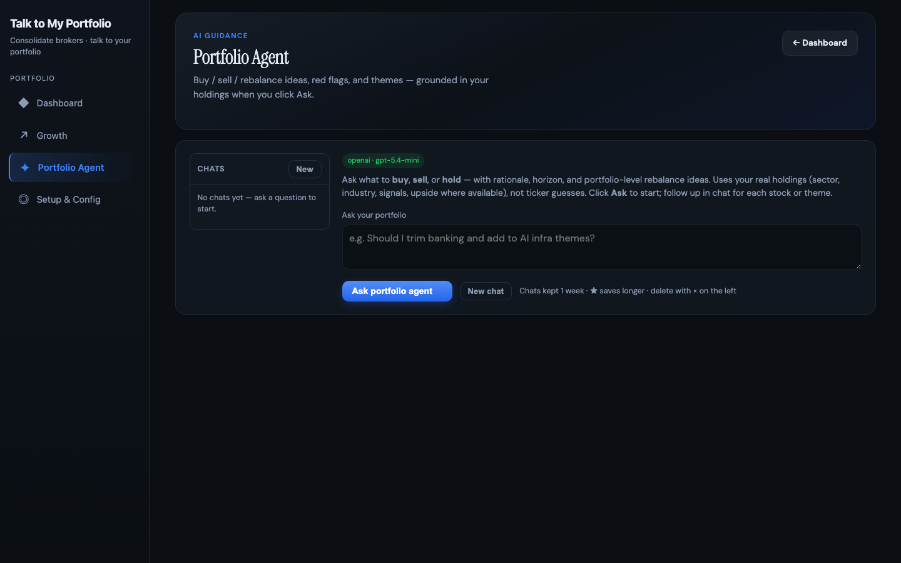
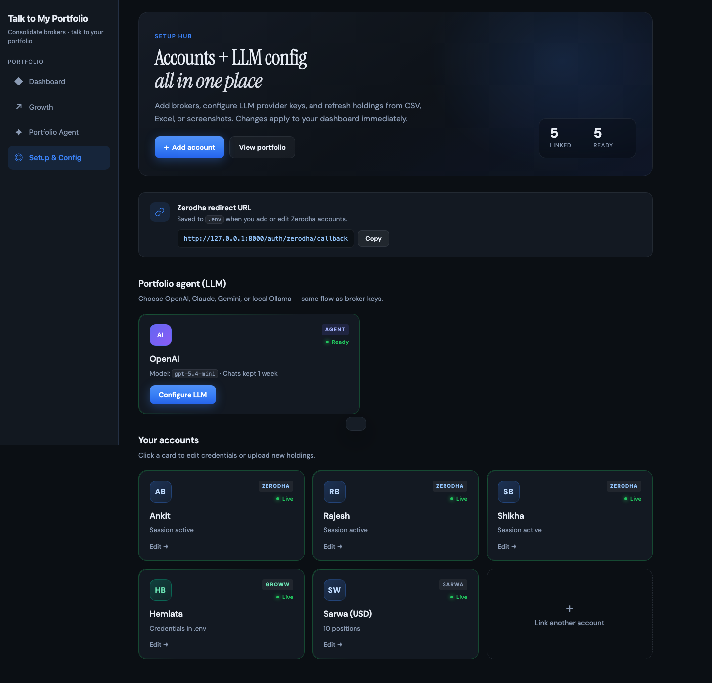
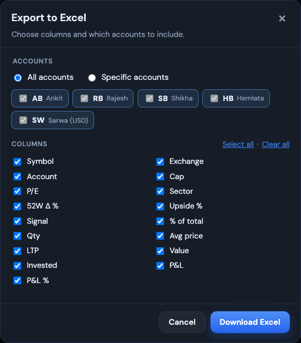

<p align="center">
  <strong>Talk to My Portfolio</strong><br>
  <sub>See every holding in one place — then <em>ask</em> what to buy, sell, trim, or hold.</sub>
</p>

<p align="center">
  <a href="https://github.com/ab9bhatia/talk-to-my-portfolio">GitHub</a>
  ·
  <a href="docs/product.md">Product guide</a>
  ·
  <a href="code_flow_and_index.md">Code index</a>
  ·
  <a href="docs/broker-api-keys.md">Broker setup</a>
  ·
  <a href="#quick-start">Quick start</a>
</p>

<p align="center">
  
  
  
</p>

---

## Why this exists

Indian families often hold stocks and funds across **Zerodha**, **Groww**, **Sarwa**, and offline sheets — but decisions still happen in fragments.

**Talk to My Portfolio** is built around: **consolidate first, then converse**. One dashboard plus a **portfolio agent** that reads your real holdings (sector, weights, signals, guardrails) and answers in plain language.

Everything runs **on your machine**. Broker data stays local; only questions you send to the agent use your LLM API key.

**Full feature list & user journey:** [docs/product.md](docs/product.md)  
**How the code is organized:** [code_flow_and_index.md](code_flow_and_index.md)

---

## Screenshots

| Dashboard | Agent | Setup | Export |
|-----------|-------|-------|--------|
|  |  |  |  |

Capture or refresh: [docs/images/README.md](docs/images/README.md)

---

## Quick start

```bash
git clone https://github.com/ab9bhatia/talk-to-my-portfolio.git
cd talk-to-my-portfolio

python3 -m venv .venv
source .venv/bin/activate   # Windows: .\.venv\Scripts\Activate.ps1
pip install -r requirements.txt

bash scripts/init_local_config.sh
uvicorn main:app --reload --host 127.0.0.1 --port 8000
```

1. **[Setup](http://127.0.0.1:8000/portfolio/setup)** — brokers, LLM, goals & guardrails  
2. **[Portfolio](http://127.0.0.1:8000/portfolio)** — holdings  
3. **[Agent](http://127.0.0.1:8000/portfolio/agent)** — ask your first question  

**Docker:** `docker build -t talk-to-my-portfolio .` then `docker run --rm -p 8000:8000 --env-file .env talk-to-my-portfolio`

---

## Configure brokers

| File | Role |
|------|------|
| `modules/portfolio/accounts.json` | Account labels & codes (gitignored) |
| `.env` | API keys — `ZERODHA_API_KEY_<ID>`, `GROWW_*`, LLM keys |

Details: **[docs/broker-api-keys.md](docs/broker-api-keys.md)**

---

## Portfolio agent (LLM)

Configure in **Setup → Portfolio agent (LLM)** — OpenAI, Claude, Gemini, or **Ollama** (local).

Goals set under **Setup → Goals & guardrails** are injected into agent context (target return, max position/sector %, risk profile). Start a **new chat** after changing goals.

---

## Routes

| Route | Purpose |
|-------|---------|
| `/portfolio` | Family dashboard |
| `/portfolio/agent` | Agent chat (SSE) |
| `/portfolio/growth` | Growth & benchmarks |
| `/portfolio/setup` | Accounts, LLM, goals, import audit |
| `/docs` | Swagger (hidden if HTTP auth on) |

---

## Security

- Do not commit `.env`, `accounts.json`, or `modules/portfolio/data/`.  
- Optional LAN auth: `PORTFOLIO_HTTP_USER` / `PORTFOLIO_HTTP_PASSWORD` in `.env`.  
- Full notes: **[docs/security.md](docs/security.md)**

---

## Docs index

| Document | Contents |
|----------|----------|
| [docs/product.md](docs/product.md) | Product journey, features, roadmap |
| [code_flow_and_index.md](code_flow_and_index.md) | Folders, files, request flows |
| [docs/api-contract-v1.md](docs/api-contract-v1.md) | Stable API for mobile clients |
| [docs/release-checklist.md](docs/release-checklist.md) | Release steps |
| [CHANGELOG.md](CHANGELOG.md) | Version history |

---

## License

MIT — add a `LICENSE` file if you open-source.
