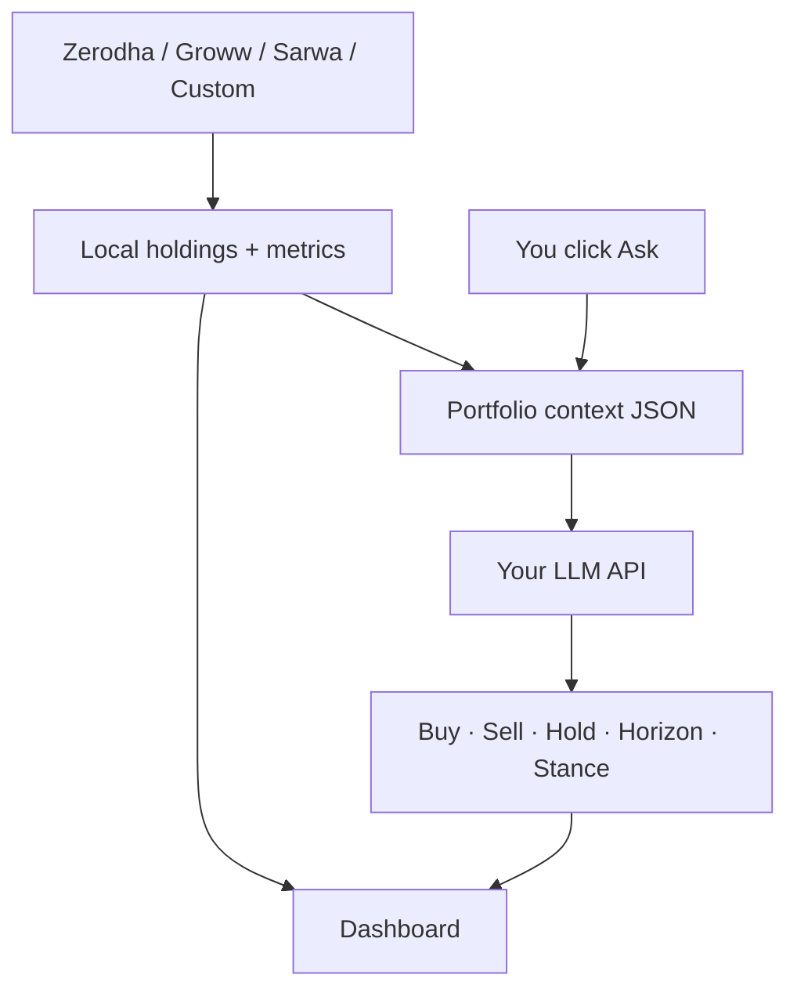

<p align="center">
  <strong>Talk to My Portfolio</strong><br>
  <sub>See every holding in one place — then <em>ask</em> what to buy, sell, trim, or hold.</sub>
</p>

<p align="center">
  <a href="https://github.com/ab9bhatia/talk-to-my-portfolio">GitHub</a>
  ·
  <a href="#features">Features</a>
  ·
  <a href="#screenshots">Screenshots</a>
  ·
  <a href="#talk-to-your-portfolio">Portfolio agent</a>
  ·
  <a href="docs/broker-api-keys.md">Broker setup</a>
  ·
  <a href="#quick-start">Quick start</a>
</p>

<p align="center">
  
  
  
</p>

---

## Why this exists

Indian families often hold stocks and funds across **Zerodha**, **Groww**, **Sarwa**, and offline sheets — but decisions still happen in fragments: one app for prices, another for news, gut feel for trim vs hold.

**Talk to My Portfolio** is built around a simple idea: **consolidate first, then converse**. You get a unified dashboard *and* an integrated **portfolio agent** that reads your real holdings (sector, cap bucket, signals, concentration) and answers in plain language.

Everything runs **on your machine**. Broker data stays local; only the questions you explicitly send to the agent use your configured LLM API key.

---

## Features

### Consolidation & dashboard

| Feature | What you get |
|---------|----------------|
| **Family dashboard** | One view across all linked accounts — total value, invested, P&amp;L, day change |
| **Holdings table** | Sortable columns: cap, sector, 52W vs high, upside %, signal (B+/B/H/S), weight %, qty, avg, LTP, value, P&amp;L |
| **Account & asset filters** | Chips for account codes (AB, RB, …) and asset class: equity, US stocks, metals, crypto, mutual funds |
| **Search & grouping** | Filter by symbol/fund; group table by cap, sector, account, signal, or asset class |
| **Row detail** | Expand a holding for account breakdown, charts, news, optional buy/sell (when trading enabled) |
| **Excel export** | Pick columns and all vs specific accounts; flat spreadsheet download |
| **Stale-first cache** | Fast page load from SQLite; background refresh for live prices and metrics |
| **HTTP Basic Auth** | Optional password when exposing the app on LAN (`PORTFOLIO_HTTP_USER` / `PASSWORD`) |

### Brokers & imports

| Feature | What you get |
|---------|----------------|
| **Zerodha (Kite)** | OAuth login per account; equity + demat MF holdings |
| **Groww** | Trade API (TOTP or API keys) |
| **Sarwa (USD)** | Weekly snapshot import for US holdings |
| **Custom portfolios** | CSV / Excel import; screenshot import with vision LLM |
| **Account hub** | Add, enable, reconnect brokers from `/portfolio/setup` |

### Analytics & history

| Feature | What you get |
|---------|----------------|
| **Daily growth** | Auto-saved on live refresh; trend chart and day-over-day by account / cap / sector |
| **Weekly history** | Immutable weekly snapshots in `portfolio_history.db` |
| **Market enrichment** | Yahoo (and caches): P/E, sector, market cap, 52W, analyst signal, upside where available |
| **Sector reference** | Persisted sector labels when Yahoo is missing (seed + optional LLM) |

### Portfolio agent (LLM)

| Feature | What you get |
|---------|----------------|
| **Integrated chat** | Dedicated `/portfolio/agent` tab; streams structured replies (SSE) |
| **Context-aware** | Uses your real holdings JSON — sectors, weights, signals, flags — not ticker guesswork |
| **Multi-turn threads** | Local session history; star important chats |
| **Provider choice** | OpenAI, Claude, Gemini, or local **Ollama** — configured in setup UI or `.env` |
| **Privacy** | No LLM calls on page load; only when you send a question |

### Optional

| Feature | What you get |
|---------|----------------|
| **Live trading** | Delivery CNC buy/sell from expanded rows when `TRADING_ENABLED=true` |
| **Buy thesis (detail)** | Optional LLM thesis on Strong-buy names (detail panel, not table clutter) |
| **REST API** | Family JSON, growth series, agent stream, Excel export — see `/docs` |

---

## Screenshots

Screenshots live in [`docs/images/`](docs/images/). After you run the app locally, capture your UI (or use the [optional script](docs/images/README.md#automated-capture-optional)) and commit the PNGs so they appear below on GitHub.

### Family dashboard

Holdings across accounts with filters, signals, and P&amp;L.


### Portfolio agent

Ask buy / sell / hold / horizon questions against your book.


### Connect accounts

Broker setup, Groww keys, Sarwa/custom import, LLM configuration.


### Export to Excel

Choose columns and which accounts to include before download.


---

## Talk to your portfolio

The agent is **built into the app**, not a separate product. Open [**Portfolio agent**](http://127.0.0.1:8000/portfolio/agent), ask a question, and get a structured advisory reply streamed in real time.

### What it helps with

| Area | Examples |
|------|----------|
| **Buy / add** | Which names to initiate, add to, or watch — with rationale |
| **Sell / trim** | Overweight positions, trim vs exit, concentration risks |
| **Hold horizon** | Time horizon guidance per idea (e.g. 3y+ core holdings) |
| **Portfolio view** | Overall stance, return outlook vs your goals, macro read |
| **Themes** | Sector/theme opportunities aligned to your actual book |
| **Red flags** | Governance, concentration, or mix issues surfaced from context |
| **Follow-ups** | Multi-turn chat — “what if I drop X and add Y?” |

### Example questions

- *Should I trim banking and add to infrastructure themes?*
- *Which holdings are weakest vs my 15% return goal?*
- *What would you exit in the next rebalance given current weights?*
- *Any red flags in my top ten positions by value?*

### How it works (privacy-first)



- **No LLM calls on page load** — only when you send a question (or follow-up).
- **Threaded chats** — sessions saved locally for continuity.
- **Not financial advice** — personal decision support; you stay in control of every trade.

Configure any supported provider under **Connect accounts → Portfolio agent (LLM)**. See [Enable the agent (LLM)](#enable-the-agent-llm).

---

## Screens & routes

| Route | Purpose |
|-------|---------|
| [`/portfolio`](http://127.0.0.1:8000/portfolio) | Family dashboard + holdings |
| [`/portfolio/agent`](http://127.0.0.1:8000/portfolio/agent) | **Portfolio agent** (chat) |
| [`/portfolio/growth`](http://127.0.0.1:8000/portfolio/growth) | **Daily growth** — value trend & day-over-day |
| [`/portfolio/setup`](http://127.0.0.1:8000/portfolio/setup) | Connect & edit accounts |
| [`/portfolio/account/{code}`](http://127.0.0.1:8000/portfolio/account/AB) | Single-account holdings |
| [`/docs`](http://127.0.0.1:8000/docs) | Swagger API |
| `POST /api/portfolio/agent/ask` | Agent (SSE stream) |
| `POST /api/portfolio/export` | Excel export (columns + accounts) |

---

## Quick start

Works on **macOS, Windows, and Linux** (Python 3.11+). Example on macOS/Linux:

```bash
git clone https://github.com/ab9bhatia/talk-to-my-portfolio.git
cd talk-to-my-portfolio

python3 -m venv .venv
source .venv/bin/activate
pip install -r requirements.txt

bash scripts/init_local_config.sh
uvicorn main:app --reload --host 127.0.0.1:8000
```

**Windows (PowerShell):**

```powershell
git clone https://github.com/ab9bhatia/talk-to-my-portfolio.git
cd talk-to-my-portfolio

py -3.11 -m venv .venv
.\.venv\Scripts\Activate.ps1
pip install -r requirements.txt

copy .env-example .env
copy modules\portfolio\accounts.example.json modules\portfolio\accounts.json
uvicorn main:app --reload --host 127.0.0.1 --port 8000
```

1. **[Connect accounts](http://127.0.0.1:8000/portfolio/setup)** — Zerodha, Groww, or custom import  
2. **[Portfolio](http://127.0.0.1:8000/portfolio)** — review holdings  
3. **[Portfolio agent](http://127.0.0.1:8000/portfolio/agent)** — ask your first question  

Optional: refresh [README screenshots](docs/images/README.md) after UI changes.

---

## Configure brokers

Two gitignored files must share the same account `"id"`:

| File | Role |
|------|------|
| `modules/portfolio/accounts.json` | Who — labels, codes (`AB`, `HB`), enabled |
| `.env` | Secrets — `ZERODHA_API_KEY_<ID>`, `GROWW_*`, etc. |

`"id": "primary"` → `ZERODHA_API_KEY_PRIMARY`, …

<details>
<summary><strong>Zerodha, Groww, Sarwa, Custom</strong> — setup steps</summary>

- **Zerodha** — [developers.kite.trade](https://developers.kite.trade/), redirect `http://127.0.0.1:8000/auth/zerodha/callback`, then **Connect** on the dashboard  
- **Groww** — [groww.in/trade-api](https://groww.in/trade-api), TOTP or API keys in `.env`  
- **Sarwa / Custom** — weekly or file import via **Connect accounts**  

Full guide: **[docs/broker-api-keys.md](docs/broker-api-keys.md)**

</details>

---

## Enable the agent (LLM)

Configure from **Connect accounts** → **Portfolio agent (LLM)** — pick a provider and model from dropdowns; **Save** writes to `.env` automatically (same as broker keys):

| Provider | What you enter |
|----------|----------------|
| **OpenAI** | API key + model (e.g. `gpt-4o-mini`) |
| **Claude (Anthropic)** | API key + model (e.g. `claude-sonnet-4-20250514`) |
| **Google Gemini** | API key + model (e.g. `gemini-2.0-flash`) |
| **Ollama (local)** | Base URL (`http://localhost:11434`) + model name (e.g. `llama3.2`) — no cloud key |

Settings are written to `.env` as `PORTFOLIO_LLM_PROVIDER`, `PORTFOLIO_LLM_MODEL`, and provider-specific keys (`PORTFOLIO_OPENAI_API_KEY`, `PORTFOLIO_ANTHROPIC_API_KEY`, `PORTFOLIO_GEMINI_API_KEY`, `PORTFOLIO_OLLAMA_BASE_URL`, …).

Manual `.env` example (OpenAI):

```text
PORTFOLIO_LLM_PROVIDER=openai
PORTFOLIO_OPENAI_API_KEY=sk-...
PORTFOLIO_LLM_MODEL=gpt-4o-mini
```

Ollama example:

```text
PORTFOLIO_LLM_PROVIDER=ollama
PORTFOLIO_OLLAMA_BASE_URL=http://localhost:11434
PORTFOLIO_LLM_MODEL=llama3.2
```

**Chat history** is kept for **1 week** (starred chats are kept longer). Other LLM-powered features:

| Feature | When it runs | Default |
|---------|----------------|---------|
| **Portfolio agent** | You send a message | On once provider is configured |
| Sarwa / screenshot import | File upload | Needs vision-capable key (OpenAI recommended) |
| Sector / buy thesis on refresh | `?refresh=1` | Off |

---

## Project layout

```text
talk-to-my-portfolio/
├── main.py
├── docs/images/              # README screenshots & demo GIFs
├── modules/portfolio/services/
│   ├── portfolio_agent.py    # talk-to-your-portfolio brain
│   ├── portfolio_context.py  # holdings → agent context
│   └── portfolio.py          # broker fetch + cache
├── shared/web/               # dashboard + agent UI
└── docs/
```

---

## Requirements

- **Python 3.11+** on macOS, Windows, or Linux  
- Zerodha Kite app(s) per login  
- Groww Trade API (optional)  
- **LLM provider** — OpenAI, Claude, Gemini, or local [Ollama](https://ollama.com) for the portfolio agent (configure in app or `.env`)

**Platform notes:** The web app and brokers are cross-platform. Optional `scripts/install_groww_reminder.sh` (macOS launchd email reminder) is macOS-only; skip it on Windows/Linux.

---

## Security

- Never commit `.env`, `accounts.json`, or `modules/portfolio/data/`  
- Agent sends **portfolio context + your question** to your chosen LLM provider when you ask — nothing automatic in the background  
- Prefer a private GitHub repo for personal forks  
- Redact or use demo data in [screenshots](docs/images/README.md) if the repo is public  

### LAN / phone access (recommended)

If another device on your network can reach the app (phone on Wi‑Fi, `0.0.0.0`, tunnel), set in `.env`:

```text
PORTFOLIO_HTTP_USER=you
PORTFOLIO_HTTP_PASSWORD=choose-a-strong-password
```

The browser will prompt once; all routes (portfolio, setup, trading API, agent) are protected. Zerodha OAuth callback stays open so Kite login still works. `/docs` is hidden while auth is on.

Leave both unset for **localhost-only** dev with no login prompt (default).

Run with `uvicorn main:app --host 127.0.0.1 --port 8000` unless you need LAN; use auth if you bind to `0.0.0.0`.

See [docs/security.md](docs/security.md) for the full threat model.

---

## API snapshot

| Method | Path | Description |
|--------|------|-------------|
| `GET` | `/portfolio` | Dashboard UI |
| `GET` | `/portfolio/agent` | Agent UI |
| `POST` | `/api/portfolio/agent/ask` | Stream advisory JSON (SSE) |
| `GET` | `/api/portfolio` | Family holdings JSON |
| `POST` | `/api/portfolio/export` | Excel export |

---

## Publish

```bash
git remote add origin https://github.com/YOUR_USER/talk-to-my-portfolio.git
git push -u origin main
```

**[github.com/ab9bhatia/talk-to-my-portfolio](https://github.com/ab9bhatia/talk-to-my-portfolio)**

---

## License

MIT — add a `LICENSE` file if you open-source.
