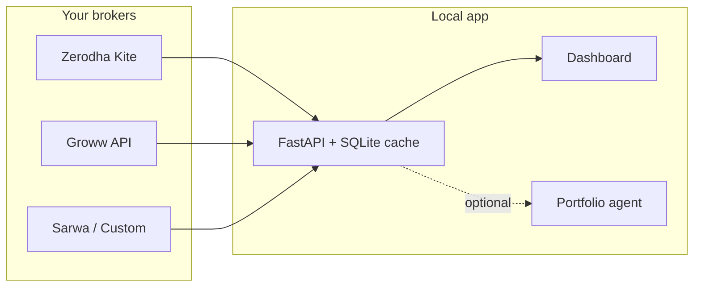

<p align="center">
  <strong>Talk to My Portfolio</strong><br>
  <sub>One dashboard for every demat account in the family — with optional AI.</sub>
</p>

<p align="center">
  <a href="https://github.com/ab9bhatia/talk-to-my-portfolio">GitHub</a>
  ·
  <a href="docs/broker-api-keys.md">Broker setup guide</a>
  ·
  <a href="#quick-start">Quick start</a>
</p>

<p align="center">
  
  
  
</p>

---

## Why this exists

Managing money across **Zerodha**, **Groww**, **Sarwa**, and ad‑hoc spreadsheets means jumping between apps, exports, and mental math. This project gives you a **single self‑hosted view**: consolidated holdings, fundamentals-style metrics, weekly history, and an optional **“talk to my portfolio”** agent — without sending your data to a third‑party SaaS.

Everything runs on **your machine**. Secrets stay in `.env`; account names live in `accounts.json` (both gitignored).

---

## What you get

| | |
|---|---|
| **Unified dashboard** | Family P&amp;L, filters by account (AB / RB / HB…), sector, cap bucket, signals |
| **Account hub** | Add, edit, and reconnect brokers in the browser — no hand-editing JSON for day‑to‑day changes |
| **Brokers** | Zerodha (Kite OAuth), Groww (Trade API), Sarwa (weekly USD), **Custom** (CSV / Excel / screenshot) |
| **Smart cache** | Stale-first SQLite snapshots; background refresh so the UI stays fast |
| **Weekly history** | Exportable snapshots in `portfolio_history.db` |
| **Portfolio agent** | Ask questions on demand (OpenAI) — never on page load by default |
| **Trading** | Optional live Buy/Sell (Zerodha CNC + Groww) when `TRADING_ENABLED=true` |

---

## Screens & routes

| Route | Purpose |
|-------|---------|
| [`/portfolio`](http://127.0.0.1:8000/portfolio) | Main dashboard — holdings, filters, summary |
| [`/portfolio/setup`](http://127.0.0.1:8000/portfolio/setup) | **Connect accounts** — add/edit brokers, upload files, update `.env` |
| [`/docs`](http://127.0.0.1:8000/docs) | Swagger API |
| `GET /api/portfolio` | Family portfolio JSON |



---

## Quick start

**~5 minutes** to a running server (broker keys come right after).

```bash
git clone https://github.com/ab9bhatia/talk-to-my-portfolio.git
cd talk-to-my-portfolio

python3 -m venv .venv
source .venv/bin/activate
pip install -r requirements.txt

bash scripts/init_local_config.sh
uvicorn main:app --reload --host 127.0.0.1:8000
```

Then open:

1. **[http://127.0.0.1:8000/portfolio/setup](http://127.0.0.1:8000/portfolio/setup)** — add Zerodha / Groww / custom portfolio (recommended)
2. **[http://127.0.0.1:8000/portfolio](http://127.0.0.1:8000/portfolio)** — view consolidated holdings

> Prefer files? Copy `accounts.example.json` → `accounts.json` and `.env-example` → `.env`, then follow [Configure brokers](#configure-brokers) below.

---

## Configure brokers

Two local files must agree on each account **`"id"`**:

| File | Role |
|------|------|
| `modules/portfolio/accounts.json` | *Who* — labels, short codes (`AB`, `HB`), enabled flags |
| `.env` | *Secrets* — API keys named from that `id` |

### Naming rule

`accounts.json` `"id": "primary"` → `.env` keys `ZERODHA_API_KEY_PRIMARY`, `ZERODHA_API_SECRET_PRIMARY`, …

<details>
<summary><strong>Zerodha</strong> — one Kite app per login</summary>

1. Create an app at [developers.kite.trade](https://developers.kite.trade/)
2. Redirect URL: `http://127.0.0.1:8000/auth/zerodha/callback`
3. Add keys to `.env`; add a row in `accounts.json`
4. On the dashboard, click **Connect Zerodha** (re-login daily ~6 AM IST)

Same redirect URL for every family member; **separate** API key/secret per person.

</details>

<details>
<summary><strong>Groww</strong> — Trade API</summary>

1. Subscribe at [groww.in/trade-api](https://groww.in/trade-api)
2. Use **TOTP** (recommended) or API key + secret in `.env`
3. Enable the account in `accounts.json`

</details>

<details>
<summary><strong>Sarwa &amp; Custom</strong></summary>

- **Sarwa** — no API; weekly snapshot or screenshot import (vision needs `OPENAI_API_KEY`)
- **Custom** — CSV/Excel or broker screenshot; shows as its own account on the dashboard

Both can be created from **Connect accounts** in the UI.

</details>

Full walkthrough: **[docs/broker-api-keys.md](docs/broker-api-keys.md)**

### Example `accounts.json` (Zerodha)

```json
{
  "id": "primary",
  "code": "AB",
  "label": "My Zerodha",
  "user_id": "YOUR_KITE_CLIENT_ID",
  "enabled": true,
  "redirect_url": "http://127.0.0.1:8000/auth/zerodha/callback"
}
```

---

## OpenAI (optional)

Nothing calls OpenAI until you opt in:

| Feature | Trigger | Config |
|---------|---------|--------|
| Portfolio agent | Click **Ask** | `OPENAI_API_KEY` |
| Sarwa / custom screenshot | Upload image | `OPENAI_API_KEY` |
| Sector / buy thesis on refresh | `?refresh=1` | `SECTOR_LLM_ON_ENRICH`, `BUY_THESIS_*` (off by default) |

---

## Project layout

```text
talk-to-my-portfolio/
├── main.py                 # FastAPI entry
├── .env-example
├── modules/portfolio/
│   ├── accounts.example.json
│   ├── accounts.json       # gitignored — your accounts
│   ├── data/               # gitignored — caches & tokens
│   └── services/           # brokers, agent, holdings
├── shared/web/             # dashboard & setup UI
└── docs/
    └── broker-api-keys.md
```

---

## Requirements

- **Python** 3.11+ (3.12+ recommended)
- **OS** macOS or Linux
- **Zerodha** — [Kite Connect](https://developers.kite.trade/) per login
- **Groww** — [Trade API](https://groww.in/trade-api) (optional)
- **OpenAI** — [API key](https://platform.openai.com/api-keys) (optional)

---

## Security

- Never commit `.env`, `accounts.json`, or `modules/portfolio/data/`
- Prefer a **private** GitHub repo if the codebase is personal
- Rotate keys if they were ever exposed

---

## API snapshot

| Method | Path | Description |
|--------|------|-------------|
| `GET` | `/portfolio` | HTML dashboard |
| `GET` | `/portfolio/setup` | Account hub |
| `GET` | `/api/portfolio` | Family JSON |
| `POST` | `/api/portfolio/agent/ask` | Agent (SSE stream) |
| `GET` | `/docs` | OpenAPI / Swagger |

---

## Publish

```bash
git remote add origin https://github.com/YOUR_USER/talk-to-my-portfolio.git
git push -u origin main
```

Upstream: **[github.com/ab9bhatia/talk-to-my-portfolio](https://github.com/ab9bhatia/talk-to-my-portfolio)**

---

## License

MIT — add a `LICENSE` file if you open-source.
