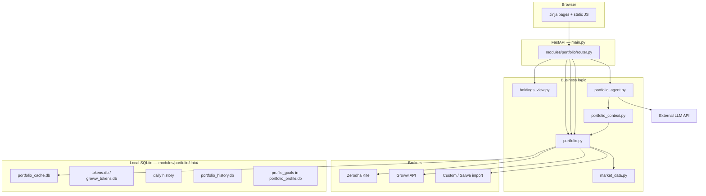

# Code flow & index

Single reference for **Talk to My Portfolio**: what each part of the repo does and how requests flow end-to-end.

**Related:** [docs/product.md](docs/product.md) (user journey & features) · [README.md](README.md) (install & run)

---

## Architecture (one screen)

**Design principle:** Dashboard reads **broker SDK → normalize → enrich (Yahoo) → cache**. The agent uses the same holdings pipeline plus **Setup → Goals & guardrails** and macro context. No duplicate fetch paths for UI vs agent.

---

## Repository index

| Path | Purpose |
|------|---------|
| `main.py` | FastAPI app, static mount, lifespan (DB init, Yahoo scheduler), `/health` |
| `requirements.txt` | Runtime dependencies |
| `requirements-dev.txt` | pytest, httpx |
| `Dockerfile` / `.dockerignore` | Container image for deployment |
| `.github/workflows/ci.yml` | Lint + pytest on push/PR |
| `CHANGELOG.md` | Release notes |
| `tests/` | API and unit tests |
| `scripts/` | Optional utilities (Groww reminder — not required at runtime) |

### `modules/portfolio/` — core domain

| Path | Purpose |
|------|---------|
| `router.py` | All HTTP routes: UI pages, JSON APIs, OAuth, export, agent, setup, growth |
| `config.py` | Account registry (`accounts.json`), env credential resolution, account codes |
| `paths.py` | `DATA_DIR` → `modules/portfolio/data/` |
| `portfolio_profile.py` | **Code defaults** for agent themes, D/E cap, env-overridable limits (fallback when Setup goals empty) |
| `accounts.example.json` | Template for gitignored `accounts.json` |
| `sector_reference.example.json` | Template for sector overrides |

#### `auth/`

| File | Role |
|------|------|
| `zerodha.py` | Kite Connect OAuth, session client |
| `groww.py` | Groww Trade API token (TOTP or API keys) |

#### `db/` — SQLite accessors

| File | Database | Role |
|------|----------|------|
| `tokens.py` | `tokens.db` | Zerodha access tokens |
| `groww_tokens.py` | `groww_tokens.db` | Groww tokens |
| `portfolio_cache.py` | `portfolio_cache.db` | Family/account snapshots, agent threads |
| `daily_history.py` | `portfolio_history.db` (daily tables) | Daily value snapshots |
| `weekly_history.py` | `portfolio_history.db` | Weekly immutable snapshots |
| `custom_holdings.py` | `custom_holdings.db` | CSV/custom positions |
| `profile_goals.py` | `portfolio_profile.db` | User goals & guardrails (Setup) |
| `import_audit.py` | `portfolio_profile.db` | Import quality audit log |
| `sector_llm_cache.py` | `sector_llm_cache.db` | LLM sector labels cache |
| `buy_thesis_cache.py` | `buy_thesis_cache.db` | Optional buy-thesis cache |
| `amfi_cap_cache.py` | `amfi_cap_cache.db` | MF cap classification cache |

#### `services/` — business logic

| File | Role |
|------|------|
| **`portfolio.py`** | Fetch & merge family holdings; normalize; enrich; cache (memory + SQLite) |
| **`holdings_view.py`** | Sort, group, aggregate, Excel export, account filters |
| **`market_data.py`** | Yahoo metrics, sector, signals, daily LTP refresh scheduler |
| **`mf_metrics.py`** | Mutual fund NAV metrics |
| **`analyst_rating.py`** | Consensus → B+/B/H/S labels |
| **`zerodha_mf.py`** | Zerodha MF holdings via Kite |
| **`groww_portfolio.py`** | Groww equity holdings |
| **`custom_portfolio.py`** | Custom CSV/Excel import |
| **`sarwa_screenshot.py`** | Sarwa image parse (vision) |
| **`weekly_recorder.py`** | Weekly snapshots, Sarwa import |
| **`daily_recorder.py`** | Seed today’s daily snapshot on refresh |
| **`daily_analytics.py`** | Growth dashboard JSON, benchmarks, timeline |
| **`daily_sheet_import.py`** | Google Sheet historical import |
| **`stock_insights.py`** | Row expander charts/news API |
| **`portfolio_context.py`** | Agent context JSON (holdings + goals + macro) |
| **`portfolio_agent.py`** | LLM prompts, SSE stream, threads |
| **`agent_threads.py`** | Chat persistence |
| **`portfolio_revalidate.py`** | Background stale refresh |
| **`onboarding.py`** | Setup hub: brokers catalog, account CRUD, imports |
| **`llm_config.py`** | Provider keys/models from `.env` |
| **`macro_snapshot.py`** | Index context for agent |
| **`orders.py`** | Optional CNC trading |
| **`env_store.py`** | Write broker/LLM vars to `.env` |
| `fx.py`, `nse_quote.py`, `amfi_cap.py`, `mf_cap.py`, … | Supporting market data |

#### `scripts/` (CLI, optional)

| Script | Role |
|--------|------|
| `record_daily_snapshots.py` | Cron-friendly daily record |
| `record_weekly_snapshots.py` | Weekly snapshot backfill |
| `refresh_snapshot_ltps.py` | Refresh current week LTPs |
| `classify_sectors.py` | Batch sector classification |

### `shared/web/` — presentation

| Path | Purpose |
|------|---------|
| `templates.py` | Jinja environment + formatters |
| `formatters.py` | INR, %, cache time, P/E display helpers |
| `http_auth.py` | Optional HTTP Basic Auth middleware |
| `uploads.py` | Multipart upload helpers |
| `templates/base.html` | Layout, nav |
| `templates/portfolio/*.html` | Dashboard, agent, growth, setup, partials |
| `static/css/app.css` | All UI styles |
| `static/js/*.js` | Page behavior (see below) |

#### Key frontend scripts

| Script | Page | Role |
|--------|------|------|
| `holdings.js` | Dashboard / account | Filters, grouping, pagination, row expand → insights |
| `portfolio-summary.js` | Dashboard | Mask/unmask amounts |
| `portfolio-export.js` | Dashboard | Excel modal |
| `portfolio-revalidate.js` | Dashboard | Poll meta after stale load |
| `portfolio-agent.js` | Agent | SSE chat, sessions |
| `portfolio-growth.js` | Growth | Charts, timeline table |
| `portfolio-setup.js` | Setup | Account modal, imports |
| `portfolio-setup-llm.js` | Setup | LLM provider modal |
| `portfolio-goals.js` | Setup | Save goals & guardrails |

### `docs/`

| Doc | Purpose |
|-----|---------|
| `product.md` | Product journey, feature map, roadmap |
| `broker-api-keys.md` | Zerodha / Groww / Sarwa setup |
| `security.md` | Threat model, LAN auth |
| `api-contract-v1.md` | Stable JSON API for mobile clients |
| `release-checklist.md` | Release steps |
### `scripts/` (repo root)

| Script | Purpose |
|--------|---------|
| `init_local_config.sh` | Copy `.env` + `accounts.json` templates |
| `install_groww_reminder.sh` | macOS launchd reminder (optional) |

---

## Request flows

### 1. Family dashboard — `GET /portfolio`

1. `router.portfolio_dashboard` — query `sort`, `order`, `group_by`, `refresh`
2. `fetch_family_portfolio(refresh)` — stale-first from SQLite, optional live broker fetch
3. `prepare_holdings_view` — aggregate by symbol, sort/group
4. Render `dashboard.html` + `holdings.js` for client filters

### 2. Live refresh — `?refresh=1` or background revalidate

1. Zerodha + Groww + custom holdings merged
2. `enrich_holdings` (Yahoo: sector, P/E, signal, 52W)
3. Write `portfolio_cache.db`; `daily_recorder` may seed today
4. If response was stale, `portfolio_revalidate` may refresh in background; client polls `/api/portfolio/meta`

### 3. Setup — `GET /portfolio/setup`

1. `onboarding.account_setup_status` — connection state per account
2. Goals form → `PUT /api/portfolio/profile/goals`
3. Data quality list from `import_audit.latest`
4. Modals: add/edit account, LLM config, file upload → `onboarding.import_account_upload`

### 4. Portfolio agent — `POST /api/portfolio/agent/ask/stream`

1. `build_portfolio_context(refresh?)` — holdings + **user goals from Setup** + sector flags + macro
2. `portfolio_agent` builds messages (system prompt references `constraints` / `investor_profile`)
3. Stream JSON from OpenAI / Claude / Gemini / Ollama
4. Persist thread in `portfolio_cache.db`

**Important:** Changing goals applies to **new** agent threads; existing threads keep the context snapshot from thread start.

### 5. Growth — `GET /portfolio/growth` + `GET /api/portfolio/daily/dashboard`

1. `daily_analytics.build_growth_dashboard` — series, day-over-day, benchmarks (Yahoo indices), account timeline
2. Optional sheet backfill via `POST /api/portfolio/daily/import-sheet`

### 6. Excel export — `POST /api/portfolio/export`

1. Body: selected columns + account codes
2. `filter_holdings_by_account_codes` → `build_holdings_excel` (openpyxl)

### 7. Zerodha OAuth

1. `GET /auth/zerodha/{code}` → Kite login URL
2. `GET /auth/zerodha/callback` → save token → invalidate portfolio cache

---

## Caching & data ownership

| Layer | TTL / rule | Location |
|-------|------------|----------|
| In-memory portfolio | ~5 min (`PORTFOLIO_CACHE_TTL_SECONDS`) | `portfolio.py` |
| SQLite snapshot | Survives restarts; stale-first | `portfolio_cache.db` |
| Yahoo per symbol | ~6 h | `market_data.py` |
| Stock insights | ~6 h | `stock_insights.py` |
| Agent threads | 1 week (starred longer) | `portfolio_cache.db` |
| Zerodha token | Until ~6 AM IST next day | `tokens.db` |

All portfolio and token data stays **on your machine** unless you call an LLM with a question.

---

## Configuration

| File | Role |
|------|------|
| `.env` | Secrets: `ZERODHA_*`, `GROWW_*`, `PORTFOLIO_LLM_*`, `PORTFOLIO_HTTP_USER`, feature flags |
| `modules/portfolio/accounts.json` | Account ids, labels, codes (AB, RB, …), enabled flags |

Account `id` in JSON maps to env suffix: `"id": "primary"` → `ZERODHA_API_KEY_PRIMARY`.

---

## API quick reference

Full mobile contract: [docs/api-contract-v1.md](docs/api-contract-v1.md).

| Method | Path | Purpose |
|--------|------|---------|
| GET | `/health` | Liveness |
| GET | `/portfolio` | Dashboard HTML |
| GET | `/portfolio/agent` | Agent HTML |
| GET | `/portfolio/growth` | Growth HTML |
| GET | `/portfolio/setup` | Setup HTML |
| GET | `/api/portfolio` | Family JSON |
| GET | `/api/portfolio/meta` | Cache freshness |
| POST | `/api/portfolio/export` | Excel download |
| GET/PUT | `/api/portfolio/profile/goals` | Goals & guardrails |
| GET | `/api/portfolio/data-quality` | Import audit |
| GET | `/api/portfolio/daily/dashboard` | Growth JSON |
| POST | `/api/portfolio/agent/ask/stream` | Agent SSE |
| GET | `/api/portfolio/version` | API contract version |

---

## Future scale (optional)

- **Android client** over frozen REST/SSE — see [docs/product.md](docs/product.md)
