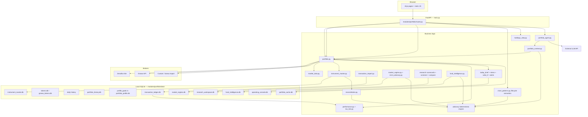

# Code flow & index

Single reference for **Talk to My Portfolio**: what each part of the repo does and how requests flow end-to-end.

**Related:** [docs/product.md](docs/product.md) (user journey & features) · [README.md](README.md) (install & run)

---

## Architecture (one screen)

```mermaid
flowchart TB
  subgraph client [Browser]
    UI[Jinja pages + static JS]
  end
  subgraph app [FastAPI — main.py]
    R[modules/portfolio/router.py]
  end
  subgraph services [Business logic]
    PF[portfolio.py]
    HV[holdings_view.py]
    MD[market_data.py]
    PAT[chart_patterns.py lifecycle semantics]
    ADV[advisory/ deterministic engine]
    IM[instrument_master.py]
    REC[reconciliation.py]
    TX[transaction_import.py]
    PERF[performance.py + tax_lots.py]
    MRMI[market_regime.py + mrmi_advisory.py]
    RESEARCH[research scorecards + screener + compare]
    FUNDS[fund_intelligence.py]
    OPS[today_brief + stress + what_if + alerts]
    CTX[portfolio_context.py]
    AG[portfolio_agent.py]
  end
  subgraph brokers [Brokers]
    Z[Zerodha Kite]
    G[Groww API]
    C[Custom / Sarwa import]
  end
  subgraph data [Local SQLite — modules/portfolio/data/]
    CACHE[portfolio_cache.db]
    TOKENS[tokens.db / groww_tokens.db]
    DAILY[daily history]
    WEEKLY[portfolio_history.db]
    GOALS[profile_goals in portfolio_profile.db]
    MASTER[instrument_master.db]
    LEDGER[transaction_ledger.db]
    REGIME[market_regime.db]
    RESEARCHDB[research_workspace.db]
    FUNDDB[fund_intelligence.db]
    OPSDB[operating_console.db]
  end
  UI --> R
  R --> PF --> Z
  R --> PF --> G
  R --> PF --> C
  PF --> MD
  PF --> IM --> MASTER
  IM --> REC --> ADV
  PF --> PERF
  TX --> LEDGER --> PERF
  MRMI --> REGIME
  MRMI --> ADV
  RESEARCH --> RESEARCHDB
  FUNDS --> FUNDDB
  FUNDS --> ADV
  OPS --> OPSDB
  PF --> OPS
  R --> PAT
  PAT --> ADV
  PF --> CACHE
  R --> HV
  R --> AG --> CTX --> PF
  CTX --> ADV
  AG --> LLM[External LLM API]
```

**Design principle:** Dashboard reads **broker SDK → normalize → enrich (Yahoo) → cache**. The agent uses the same holdings pipeline plus **Setup → Goals & guardrails** and macro context. No duplicate fetch paths for UI vs agent.

---

## Repository index

| Path | Purpose |
|------|---------|
| `main.py` | FastAPI app, static mount, lifespan (DB init, Yahoo scheduler), `/health` |
| `requirements.txt` | Runtime dependencies |
| `requirements-dev.txt` | pytest, httpx |
| `Dockerfile` / `.dockerignore` | Container image for deployment |
| `.github/workflows/ci.yml` | Lint + pytest on push/PR |
| `CHANGELOG.md` | Release notes |
| `tests/` | API and unit tests |
| `scripts/` | Optional utilities (Groww reminder — not required at runtime) |

### `modules/portfolio/` — core domain

| Path | Purpose |
|------|---------|
| `router.py` | All HTTP routes: UI pages, JSON APIs, OAuth, export, agent, setup, growth |
| `config.py` | Account registry (`accounts.json`), env credential resolution, account codes |
| `account_profile.py` | Validated local account/tax profile schema and legacy-safe defaults |
| `paths.py` | `DATA_DIR` → `modules/portfolio/data/` |
| `portfolio_profile.py` | **Code defaults** for agent themes, D/E cap, env-overridable limits (fallback when Setup goals empty) |
| `accounts.example.json` | Template for gitignored `accounts.json` |
| `sector_reference.example.json` | Template for sector overrides |

#### `auth/`

| File | Role |
|------|------|
| `zerodha.py` | Kite Connect OAuth, session client |
| `groww.py` | Groww Trade API token (TOTP or API keys) |

#### `db/` — SQLite accessors

| File | Database | Role |
|------|----------|------|
| `tokens.py` | `tokens.db` | Zerodha access tokens |
| `groww_tokens.py` | `groww_tokens.db` | Groww tokens |
| `portfolio_cache.py` | `portfolio_cache.db` | Family/account snapshots, agent threads |
| `daily_history.py` | `portfolio_history.db` (daily tables) | Daily value snapshots |
| `weekly_history.py` | `portfolio_history.db` | Weekly immutable snapshots |
| `weekly_sync.py` | `weekly_sync.db` | Weekly run, step, account-state, artifact, and notification audit |
| `custom_holdings.py` | `custom_holdings.db` | CSV/custom positions |
| `profile_goals.py` | `portfolio_profile.db` | User goals & guardrails (Setup) |
| `import_audit.py` | `portfolio_profile.db` | Import quality audit log |
| `sector_llm_cache.py` | `sector_llm_cache.db` | LLM sector labels cache |
| `buy_thesis_cache.py` | `buy_thesis_cache.db` | Optional buy-thesis cache |
| `amfi_cap_cache.py` | `amfi_cap_cache.db` | MF cap classification cache |
| `instrument_master.py` | `instrument_master.db` | Versioned instruments, aliases, corporate actions, and override audit |
| `transaction_ledger.py` | `transaction_ledger.db` | Preview batches, canonical transactions, unresolved queue, rollback |
| `market_regime.py` | `market_regime.db` | Append-only methodology-versioned MRMI observations |
| `research.py` | `research_workspace.db` | Saved screens/revisions, candidates, watchlists, thesis, sourced events |
| `fund_intelligence.py` | `fund_intelligence.db` | Scheme variants and dated constituent observations |
| `operating_console.py` | `operating_console.db` | Saved stress assumptions and alert hysteresis/history |

#### `services/` — business logic

| File | Role |
|------|------|
| **`portfolio.py`** | Fetch & merge family holdings; normalize; enrich; cache (memory + SQLite) |
| **`holdings_view.py`** | Sort, group, aggregate, Excel export, account filters |
| **`instrument_master.py`** | Authoritative-first canonical identity resolver and normalized instrument metadata |
| **`reconciliation.py`** | Broker/market provenance and position, security, account, family reconciliation |
| **`transaction_import.py`** | Pluggable normalized preview/commit/rollback import framework |
| **`tax_lots.py`** | Account-specific FIFO lot transformations and disposal audit |
| **`performance.py`** | Coverage-aware XIRR, TWRR, return bridge, FX/fee/tax attribution |
| **`performance_export.py`** | Multi-sheet transaction/lot/performance/reconciliation audit workbook |
| **`market_regime.py`** | Sourced component normalization, confidence, bands, trend, persistence |
| **`mrmi_advisory.py`** | Timing/sizing-only deterministic recommendation overlay |
| **`mrmi_backtest.py`** | Research-only no-look-ahead calibration harness |
| **`research_scorecards.py`** | Instrument-specific transparent scorecard adapters |
| **`research_screener.py`** | Whitelisted typed AND/OR screening engine |
| **`research_compare.py`** | Two-to-five instrument comparison with incompatibility explanations |
| **`research_events.py`** | Sourced event freshness and candidate-approval boundary |
| **`research_context.py`** | Structured redacted LLM explanation context |
| **`fund_intelligence.py`** | Recursive look-through, overlap, family exposure, TER, ETF/MF analytics, consolidation |
| **`fund_export.py`** | Scheme, constituent, and overlap audit workbook |
| **`today_brief.py`** | Material review queue and no-action summary |
| **`stress_testing.py`** | Versioned direct/look-through deterministic shocks |
| **`what_if.py`** | Immutable constraint-aware portfolio simulation |
| **`alerts.py`** | Material-event filtering, hysteresis, and cooldown |
| **`market_data.py`** | Yahoo metrics, sector, signals, daily LTP refresh scheduler |
| **`advisory/`** | Deterministic consolidation, scenarios, momentum, rules, sourced tax safety records, and recommendation schema |
| **`mf_metrics.py`** | Mutual fund NAV metrics |
| **`analyst_rating.py`** | Consensus → B+/B/H/S labels |
| **`zerodha_mf.py`** | Zerodha MF holdings via Kite |
| **`groww_portfolio.py`** | Groww equity holdings |
| **`custom_portfolio.py`** | Custom CSV/Excel import |
| **`sarwa_screenshot.py`** | Sarwa image parse (vision) |
| **`weekly_recorder.py`** | Weekly snapshots, Sarwa import |
| **`weekly_sync.py`** | One-shot orchestration, lock, idempotency, degraded states, advisory summary, local digest |
| **`daily_recorder.py`** | Seed today’s daily snapshot on refresh |
| **`daily_analytics.py`** | Growth dashboard JSON, benchmarks, timeline |
| **`daily_sheet_import.py`** | Google Sheet historical import |
| **`stock_insights.py`** | Row expander charts/news API |
| **`portfolio_context.py`** | Agent context JSON (holdings + goals + macro) |
| **`portfolio_agent.py`** | LLM prompts, SSE stream, threads |
| **`agent_threads.py`** | Chat persistence |
| **`portfolio_revalidate.py`** | Background stale refresh |
| **`onboarding.py`** | Setup hub: brokers catalog, account CRUD, imports |
| **`llm_config.py`** | Provider keys/models from `.env` |
| **`macro_snapshot.py`** | Index context for agent |
| **`orders.py`** | Optional CNC trading |
| **`env_store.py`** | Write broker/LLM vars to `.env` |
| `fx.py`, `nse_quote.py`, `amfi_cap.py`, `mf_cap.py`, … | Supporting market data |

#### `scripts/` (CLI, optional)

| Script | Role |
|--------|------|
| `record_daily_snapshots.py` | Cron-friendly daily record |
| `record_weekly_snapshots.py` | Weekly snapshot backfill |
| `weekly_sync.py` | Auditable weekly operating job used by CLI and schedulers |
| `refresh_snapshot_ltps.py` | Refresh current week LTPs |
| `classify_sectors.py` | Batch sector classification |

### `shared/web/` — presentation

| Path | Purpose |
|------|---------|
| `templates.py` | Jinja environment + formatters |
| `formatters.py` | INR, %, cache time, P/E display helpers |
| `http_auth.py` | Optional HTTP Basic Auth middleware |
| `uploads.py` | Multipart upload helpers |
| `templates/base.html` | Layout, nav |
| `templates/portfolio/*.html` | Dashboard, agent, growth, setup, partials |
| `static/css/app.css` | All UI styles |
| `static/js/*.js` | Page behavior (see below) |

#### Key frontend scripts

| Script | Page | Role |
|--------|------|------|
| `holdings.js` | Dashboard / account | Filters, grouping, pagination, row expand → insights |
| `portfolio-summary.js` | Dashboard | Mask/unmask amounts |
| `portfolio-export.js` | Dashboard | Excel modal |
| `portfolio-revalidate.js` | Dashboard | Poll meta after stale load |
| `portfolio-agent.js` | Agent | SSE chat, sessions |
| `portfolio-growth.js` | Growth | Charts, timeline table |
| `portfolio-setup.js` | Setup | Account modal, imports |
| `portfolio-setup-llm.js` | Setup | LLM provider modal |
| `portfolio-goals.js` | Setup | Save goals & guardrails |
| `portfolio-weekly-sync.js` | Setup | Run the one-shot sync and present its audited result |
| `portfolio-data-quality.js` | Data Quality | Submit sourced, audited local reconciliation resolutions |
| `portfolio-performance.js` | Growth | True-performance cards, coverage explanation, and return bridge |
| `portfolio-market-regime.js` | Market Mood | Versioned MRMI history chart |
| `portfolio-operating-console.js` | Today Brief | Stress runner and read-only what-if builder |

### `docs/`

| Doc | Purpose |
|-----|---------|
| `product.md` | Product journey, feature map, roadmap |
| `broker-api-keys.md` | Zerodha / Groww / Sarwa setup |
| `security.md` | Threat model, LAN auth |
| `api-contract-v1.md` | Stable JSON API for mobile clients |
| `release-checklist.md` | Release steps |
### `scripts/` (repo root)

| Script | Purpose |
|--------|---------|
| `init_local_config.sh` | Copy `.env` + `accounts.json` templates |
| `install_groww_reminder.sh` | macOS launchd reminder (optional) |
| `install_weekly_sync_macos.sh` | Install/uninstall the Friday + Saturday launchd job |
| `install_weekly_sync_linux.sh` | Install/uninstall the systemd user timer |
| `Install-WeeklySyncWindows.ps1` | Install/uninstall Windows scheduled tasks |

---

## Request flows

### 1. Family dashboard — `GET /portfolio`

1. `router.portfolio_dashboard` — query `sort`, `order`, `group_by`, `refresh`
2. `fetch_family_portfolio(refresh)` — stale-first from SQLite, optional live broker fetch
3. `prepare_holdings_view` — aggregate by symbol, sort/group
4. Render `dashboard.html` + `holdings.js` for client filters

### 2. Live refresh — `?refresh=1` or background revalidate

1. Zerodha + Groww + custom holdings merged
2. `enrich_holdings` (Yahoo: sector, P/E, signal, 52W)
3. Write `portfolio_cache.db`; `daily_recorder` may seed today
4. If response was stale, `portfolio_revalidate` may refresh in background; client polls `/api/portfolio/meta`

### 3. Setup — `GET /portfolio/setup`

1. `onboarding.account_setup_status` — connection state per account
2. Goals form → `PUT /api/portfolio/profile/goals`
3. Data quality list from `import_audit.latest`
4. Modals: add/edit account, LLM config, file upload → `onboarding.import_account_upload`

### 4. Portfolio agent — `POST /api/portfolio/agent/ask/stream`

1. `build_portfolio_context(refresh?)` — canonical holdings + **user goals from Setup**
2. `advisory.service` builds the versioned deterministic recommendation payload from that same family snapshot
3. Context adds sector flags, macro, and the deterministic `advisory` block
4. `portfolio_agent` builds messages (system prompt references `constraints` / `investor_profile`)
5. Stream JSON from OpenAI / Claude / Gemini / Ollama; malformed JSON retains deterministic advice
6. Persist thread in `portfolio_cache.db`

**Important:** Changing goals applies to **new** agent threads; existing threads keep the context snapshot from thread start.

### 4A. Weekly operating job — CLI, Setup, or OS scheduler

1. Every entry point calls `services.weekly_sync.run_weekly_sync`; scheduling contains no portfolio logic.
2. Async acceptance writes durable `QUEUED` truth before the one-worker executor starts; startup recovers orphaned jobs as `INTERRUPTED`.
3. The job audits its run, acquires `weekly-sync.lock`, and checks ISO-week/stage/mode/account-set/policy idempotency.
4. Friday `INDIA_CLOSE` may use live quantities; Saturday `GLOBAL_CLOSE_FINALIZATION` retains durable quantities while refreshing late global prices against Friday's market-session date.
5. Each enabled account receives separate position/price timestamps and a live, cached, manual-current/stale, auth, import, or failed state.
6. Only validated non-empty runs write canonically aggregated daily/weekly snapshots with quality, coverage, and comparability metadata.
7. Recommendation history diffs material fields; the digest separates urgent, execution-ready, research/watch, and CA-review items.
8. Markdown/HTML delivery remains local and no execution API is called.

### 5. Growth — `GET /portfolio/growth` + `GET /api/portfolio/daily/dashboard`

1. `daily_analytics.build_growth_dashboard` — quality-aware series, comparable day-over-day observations, benchmarks (Yahoo indices), account timeline
2. Optional sheet backfill via `POST /api/portfolio/daily/import-sheet`

### 5A. Pattern radar and Action Center

1. `GET /api/portfolio/patterns` reuses the canonical holdings view and scans each
   unique symbol/exchange through `chart_patterns.py`.
2. The detector preserves legacy fields and adds lifecycle, target status,
   heuristic-score semantics, currency, and an estimated trading-session window.
3. `advisory/runtime.py` attaches the local scan to the canonical family snapshot;
   `advisory/patterns.py` admits only fresh confirmed/retesting active targets as
   bounded timing evidence.
4. `GET /api/portfolio/advisory` returns the same deterministic payload consumed by
   `/portfolio/advisor`. JavaScript formats and filters it but adds no decision logic.
5. Completed or expired targets remain visible for audit and cannot create a trade,
   cancel a fundamental sell, or delay a planned reduction.

### 5B. Shared decision presentation — Milestone 12

1. `advisory/rules.py` selects the immutable action, sell type, target weight, and sell percentage from deterministic evidence.
2. `advisory/presentation.py` is the only action-label mapper. It adds readiness, Do now, How much, review trigger, and timing-only execution language.
3. `advisory/runtime.build_decision_summary` caches the pattern-free, LLM-free Dashboard projection; canonical instrument ID and ISIN drive the join.
4. Dashboard, Action Center, Today Brief, weekly output, and Portfolio Agent consume `decision_presentation` rather than translating raw actions independently.
5. `external_analyst_view` is neutral context. `chart_pattern` is execution timing. Neither can alter the action selected in step 1.
6. A Dashboard Prepare control exists only for a `READY_TO_REVIEW` add/trim/exit with trading enabled and a supported delivery account. Rendering never calls the order endpoint.

### 6. Excel export — `POST /api/portfolio/export`

1. Body: selected columns + account codes
2. `filter_holdings_by_account_codes` → `build_holdings_excel` (openpyxl)

### 7. Zerodha OAuth

1. `GET /auth/zerodha/{code}` → Kite login URL
2. `GET /auth/zerodha/callback` → save token → invalidate portfolio cache

---

## Caching & data ownership

| Layer | TTL / rule | Location |
|-------|------------|----------|
| In-memory portfolio | ~5 min (`PORTFOLIO_CACHE_TTL_SECONDS`) | `portfolio.py` |
| SQLite snapshot | Survives restarts; stale-first | `portfolio_cache.db` |
| Yahoo per symbol | ~6 h | `market_data.py` |
| Stock insights | ~6 h | `stock_insights.py` |
| Agent threads | 1 week (starred longer) | `portfolio_cache.db` |
| Zerodha token | Until ~6 AM IST next day | `tokens.db` |

All portfolio and token data stays **on your machine** unless you call an LLM with a question.

---

## Configuration

| File | Role |
|------|------|
| `.env` | Secrets: `ZERODHA_*`, `GROWW_*`, `PORTFOLIO_LLM_*`, `PORTFOLIO_HTTP_USER`, feature flags |
| `modules/portfolio/accounts.json` | Account ids, labels, codes (AB, RB, …), enabled flags |
| `PORTFOLIO_DATA_DIR` | Optional local SQLite directory override; tests use a temporary directory automatically |

Account `id` in JSON maps to env suffix: `"id": "primary"` → `ZERODHA_API_KEY_PRIMARY`.

---

## API quick reference

Full mobile contract: [docs/api-contract-v1.md](docs/api-contract-v1.md).

| Method | Path | Purpose |
|--------|------|---------|
| GET | `/health` | Liveness |
| GET | `/portfolio` | Dashboard HTML |
| GET | `/portfolio/agent` | Agent HTML |
| GET | `/portfolio/growth` | Growth HTML |
| GET | `/portfolio/setup` | Setup HTML |
| GET | `/api/portfolio` | Family JSON |
| GET | `/api/portfolio/meta` | Cache freshness |
| GET | `/api/portfolio/advisory/decision-summary` | Cached Dashboard decision projection; no patterns or LLM |
| GET | `/api/portfolio/advisory` | Full deterministic recommendations with optional timing overlay |
| POST | `/api/portfolio/export` | Excel download |
| GET/PUT | `/api/portfolio/profile/goals` | Goals & guardrails |
| GET | `/api/portfolio/data-quality` | Import audit |
| GET | `/api/portfolio/daily/dashboard` | Growth JSON |
| GET | `/api/portfolio/sync/status` | Weekly job health + degraded accounts |
| GET | `/api/portfolio/sync/runs/{run_id}` | Structured run/step/account audit |
| POST | `/api/portfolio/sync/weekly` | Run the same one-shot job as CLI/scheduler |
| POST | `/api/portfolio/sync/weekly/async` | Persist and queue the one-worker background job |
| GET | `/api/portfolio/sync/jobs/{run_id}` | Poll durable queued/running/terminal truth |
| POST | `/api/portfolio/agent/ask/stream` | Agent SSE |
| GET | `/api/portfolio/version` | API contract version |
| GET/POST | `/api/portfolio/tax/*` | Sourced rules, after-tax comparison, location planning, harvesting, and CA export |

After-tax planning lives in `services/after_tax.py`, `services/asset_location.py`, and `services/tax_harvesting.py`. It reuses the versioned registry in `services/advisory/tax_rules.py`, account configuration in `account_profile.py`, and FIFO ledger output from `services/tax_lots.py`. `services/tax_location_export.py` produces the local CA-review workbook.

Security/recovery flows use `services/secret_storage.py` for verified OS/encrypted secret migration, `db/schema_migrations.py` for integrity/version refusal, `services/backup_restore.py` for encrypted staged restore, `shared/web/http_auth.py` for auth/CSRF/rate limits/headers, and `services/diagnostics.py` for redacted health/support bundles. The offline operator entry point is `scripts/portfolio_recovery.py`.

---

## Future scale (optional)

- **Android client** over frozen REST/SSE — see [docs/product.md](docs/product.md)
