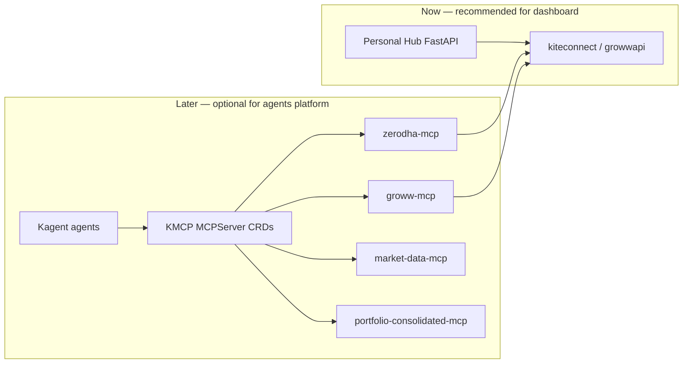

# KMCP / Kagent roadmap (MCP layer)

**Context:** Personal Hub today is a **single FastAPI app** (Jinja + SQLite + direct broker SDKs). The older [portfolio-hub-architecture.md](./portfolio-hub-architecture.md) describes a **Kubernetes + Kagent + KMCP** target. This doc clarifies **when that makes sense** and how it relates to Groww API (direct) and Zerodha (direct).

---

## Two layers — do not conflate

| Layer | What it is | Your repo today |
|-------|------------|-----------------|
| **Hub (data plane)** | Web UI, cache, family portfolio, agent UI | `main.py`, `modules/portfolio/`, `portfolio_cache.db` |
| **MCP (tool plane)** | Standard tools for **AI agents** (Cursor, Kagent) | Not implemented; optional in Cursor via third-party Groww MCP |



**Rule:** Dashboard reads **SDK → normalize → cache**. Agents *may* read **MCP tools** that wrap the **same SDK** — never require MCP for page load.

---

## Does KMCP / Kagent make sense for you?

### Yes, later — if you want:

- Multiple **autonomous agents** (portfolio, alerts, research) running in **K8s**, not inside FastAPI
- **Cursor / Claude / Kagent** all using the **same** broker tools via MCP
- **GitOps** deploy of broker connectors (ArgoCD in your architecture doc)
- Separation of concerns: hub UI vs agent runtime

### No / not yet — if you only need:

- Family dashboard + Excel export + portfolio agent Ask button
- One machine, `uvicorn`, personal use
- Fast iteration without cluster ops

**Recommendation:** Finish **Groww API in the hub** first. Introduce KMCP when you either (a) deploy to K8s, or (b) want Kagent to run scheduled analysis/agents outside the web process.

---

## Suggested MCP inventory (when you adopt KMCP)

| MCP server | Tools (examples) | Backing implementation | Hub overlap |
|------------|------------------|------------------------|-------------|
| **zerodha-mcp** | `get_holdings`, `get_positions`, `get_margins` | Kite Connect + `tokens.db` | Same as `fetch_portfolio` |
| **groww-mcp** | `get_holdings`, `get_positions` | `growwapi` + `groww_tokens.db` | Same as `groww_portfolio.py` |
| **dhan-mcp** | `get_holdings` | DhanHQ API | Future |
| **market-data-mcp** | `get_quote`, `get_fundamentals`, `get_news` | yfinance + screener (optional) | Same as `market_data.py` / `stock_insights.py` |
| **portfolio-consolidated-mcp** | `get_family_portfolio`, `get_allocation_by_sector` | Calls broker MCPs or shared Python lib | Same as `fetch_family_portfolio` |

**Important:** `portfolio-consolidated-mcp` should call a **shared Python package** (`portfolio_core` or `modules/portfolio/services/`), not duplicate HTTP to other MCPs in production (avoids double latency). MCP servers become thin wrappers:

```text
@mcp.tool get_holdings → portfolio.services.zerodha.fetch_holdings()
```

---

## KMCP / Kagent registration (target shape)

When ready, each server is an **MCPServer** CRD (from your architecture doc):

```yaml
apiVersion: kagent.dev/v1alpha1
kind: MCPServer
metadata:
  name: groww-mcp
spec:
  url: http://groww-mcp.portfolio.svc:8080/mcp
  # transport: streamable-http (FastMCP default)
```

Agents reference tools:

```yaml
# PortfolioAgent
tools:
  - mcpServer: portfolio-consolidated-mcp
  - mcpServer: market-data-mcp
```

**Cursor (local dev):** parallel config in `~/.cursor/mcp.json` pointing to `http://127.0.0.1:8xxx/sse` for each self-hosted server — same tools as Kagent.

---

## Migration path (hub → hub + KMCP)

### Stage A — Monolith (current → +Groww)

- FastAPI hub only  
- All brokers via SDK  
- Portfolio agent: OpenAI + `portfolio_context.py`  

### Stage B — Extract libraries (prep for MCP)

- Move broker fetch + normalize into importable modules (already mostly there)  
- Add `fastmcp` servers as **thin** wrappers in `mcp-servers/`  
- Run locally: `uvicorn` + `python -m mcp_servers.groww`  

### Stage C — Dual consumers

- **Hub** imports `modules.portfolio.services.*` (no MCP hop)  
- **Kagent / Cursor** use MCP tools  
- Shared SQLite: tokens for Zerodha/Groww on a volume or host path  

### Stage D — K8s + KMCP + ArgoCD

- Deploy MCP servers as Deployments + Services  
- Register MCPServer CRDs  
- Optional: Envoy gateway in front of hub + agents (from architecture doc)  
- Hub may stay monolith on laptop OR move to cluster  

---

## Groww: API vs groww-mcp in KMCP

| Approach | Dashboard | Kagent/Cursor |
|----------|-----------|---------------|
| **Direct API only** | ✅ | ❌ (unless you build custom tools in agent) |
| **API + groww-mcp** | ✅ via shared lib | ✅ via MCP |
| **MCP only in dashboard** | ⚠️ Possible but discouraged | ✅ |

**Plan:** Implement **Groww API once** in `groww_portfolio.py`. When you add KMCP, `groww-mcp` calls that module — zero duplicate business logic.

Official Groww MCP (`https://mcp.groww.in/mcp`) is fine for **Cursor-only** experiments; for Kagent/KMCP you’ll want **self-hosted** servers with your tokens on your infra.

---

## Pros / cons of adopting KMCP now vs later

| Adopt now | Wait until after Groww hub |
|-----------|---------------------------|
| Early alignment with K8s vision | Faster multi-broker dashboard |
| Cursor + Kagent share tools day one | Less ops complexity |
| | Extract MCP from proven Python code |
| | Avoid maintaining two half-baked paths |

**Verdict:** **Wait.** Land Groww in hub (Stages A→B lite). Add KMCP when you run agents in K8s or need consolidated MCP for multiple AI clients.

---

## Effort rough estimate (KMCP phase, after hub stable)

| Item | Effort |
|------|--------|
| fastmcp zerodha-mcp (thin wrapper) | 1 day |
| fastmcp groww-mcp (thin wrapper) | 0.5 day |
| market-data-mcp | 1 day |
| portfolio-consolidated-mcp | 1–2 days |
| Kagent agents + CRDs + local k3d | 2–3 days |
| ArgoCD / production hardening | 3+ days |

---

## Action items (ordered)

1. **Now:** Execute [groww-api-integration-plan.md](./groww-api-integration-plan.md) Phases 0–3.  
2. **When hub is multi-broker stable:** Extract shared `fetch_*` functions; add `mcp-servers/*/server.py` wrappers.  
3. **When you need K8s agents:** Register MCPServer CRDs; wire Kagent PortfolioAgent to `portfolio-consolidated-mcp`.  
4. **Update** `portfolio-hub-architecture.md` broker table: Groww = official Trade API (deprecate “no API” note).

---

## Related docs

- [portfolio-memory.md](./portfolio-memory.md) — cache / STM / LTM (hub)  
- [portfolio-hub-architecture.md](./portfolio-hub-architecture.md) — full K8s vision (reference)  
- [groww-api-integration-plan.md](./groww-api-integration-plan.md) — Groww Trade API  
