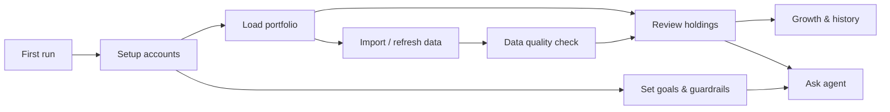

# Product guide — Talk to My Portfolio

**Audience:** Product owners, contributors, and power users.  
**Technical index:** [code_flow_and_index.md](../code_flow_and_index.md) · **Install:** [README.md](../README.md)

---

## Vision

Indian families often hold equities and funds across **Zerodha**, **Groww**, **US brokers (Sarwa)**, and offline sheets — but decisions stay fragmented: one app for prices, another for news, gut feel for trim vs hold.

**Talk to My Portfolio** follows one loop:

1. **Consolidate** — one family dashboard with real holdings, weights, and signals.  
2. **Understand** — growth history, benchmarks, concentration.  
3. **Converse** — ask the portfolio agent using *your* book and *your* guardrails (not generic ticker tips).

Everything runs **local-first**. Broker data and chat history stay on your machine; the LLM only sees what you send when you ask.

---

## User journey

| Stage | User action | Outcome |
|-------|-------------|---------|
| **Onboard** | Clone repo, `init_local_config.sh`, start server | App at `http://127.0.0.1:8000` |
| **Connect** | Setup → Zerodha OAuth / Groww keys / custom file / Sarwa screenshot | Accounts show Live or Configured |
| **Configure agent** | Setup → LLM provider + model | Agent tab ready |
| **Set guardrails** | Setup → Goals (target return, max position %, sector cap, risk) | Agent and concentration flags use your limits |
| **Daily use** | Portfolio → filter, sort, expand rows, export Excel | Decisions on consolidated book |
| **Track progress** | Growth → charts, timeline, optional sheet import | Long-term view vs benchmarks |
| **Ask** | Agent → new chat after goal changes | Buy / trim / hold / rebalance guidance |
| **Trust data** | Setup → Data quality after imports | Confirm mappings, fix unresolved sheet columns |

---

## Feature map

### Consolidation (core)

| Feature | Value for investor |
|---------|-------------------|
| Family dashboard | Total value, invested, P&amp;L across accounts |
| Holdings table | Cap, sector, 52W vs high, upside %, signal (B+/B/H/S), weight % |
| Filters & grouping | By account code, asset class, symbol search; group by cap/sector/signal |
| Row detail | Charts, news, account breakdown; optional trade actions |
| Excel export | Choose columns and accounts before download |
| Stale-first cache | Fast load; background refresh for live prices |

### Brokers & data in

| Broker / source | How |
|-----------------|-----|
| Zerodha | Kite OAuth per account |
| Groww | Trade API (TOTP or API keys) |
| Sarwa | Weekly screenshot or import |
| Custom | CSV / Excel / screenshot |
| Google Sheet | Distribution tab → daily history (Growth import API) |

### Analytics

| Feature | Value |
|---------|--------|
| Daily growth | Auto-snapshot on live refresh; trend + day-over-day |
| Indexed performance | Relative view when absolute INR looks flat |
| Account mix | Who drives family value over time |
| Benchmark overlay | Portfolio vs NIFTY50 / S&amp;P500 (indexed) |
| Date-wise timeline | Family + per-account invested/value |
| Weekly history | Immutable weekly snapshots for longer audits |

### Portfolio agent

| Feature | Value |
|---------|--------|
| Context-aware chat | Real holdings, sectors, weights, flags — not ticker guessing |
| Goals in prompt | Target return, max position/sector %, risk profile from Setup |
| Multi-turn threads | Follow-ups with local history |
| Providers | OpenAI, Claude, Gemini, Ollama |
| Privacy | No LLM on page load |

### Setup & trust

| Feature | Value |
|---------|--------|
| Account hub | Add, edit, reconnect, import |
| Goals & guardrails | Personal risk frame for agent |
| Data quality log | Post-import audit: row counts, unresolved account mappings |
| HTTP Basic Auth | Optional LAN protection |

### Platform (engineering)

| Feature | Status |
|---------|--------|
| pytest + CI | Baseline tests on push |
| Docker image | Production run profile |
| API contract v1 | Frozen endpoints for future Android client |

---

## What we deliberately avoid (for now)

- **Not** a robo-advisor or execution-only app — you stay in control of trades.  
- **Not** cloud-hosted portfolio data by default — local SQLite.  
- **Mobile trading** — Android MVP is read-only + agent; orders stay web-first until auth/audit harden.  
- **Separate agent platform** — not required; the in-app agent uses the same portfolio services as the UI.

---

## Roadmap (product lens)

| Horizon | Theme |
|---------|--------|
| **Now** | Consolidation + agent + growth + Setup trust (goals, data quality) |
| **Next** | Dashboard breach chips (position/sector vs guardrails), alert center, rebalance planner |
| **Mobile** | Kotlin client on [api-contract-v1.md](api-contract-v1.md) |
| **Scale** | Scheduled digests / alerts (future) |

---

## Screens & routes

| Route | Purpose |
|-------|---------|
| `/portfolio` | Family dashboard |
| `/portfolio/agent` | Portfolio agent |
| `/portfolio/growth` | Growth analytics |
| `/portfolio/setup` | Accounts, LLM, goals, data quality |
| `/portfolio/account/{code}` | Single-account view |

---

## Domain notes (equity markets)

- **Signals (B+/B/H/S)** derive from analyst consensus / upside where Yahoo provides data — aids scan, not a buy list.  
- **Sector labels** prefer Yahoo industry data; ticker substrings are never used to infer theme (e.g. infrastructure vs “data center” false positives).  
- **INR family view** may mix USD (Sarwa) after FX conversion — agent context includes account labels.  
- **Historical sheet points** may be monthly/irregular; Growth charts combine sheet history with live daily snapshots — use indexed view for shape, absolute for level.

---

## Documentation map

| Doc | Use when |
|-----|----------|
| [README.md](../README.md) | Install, security summary |
| [code_flow_and_index.md](../code_flow_and_index.md) | Code navigation, request flows |
| [broker-api-keys.md](broker-api-keys.md) | Broker credentials |
| [security.md](security.md) | Threat model |
| [api-contract-v1.md](api-contract-v1.md) | Building a mobile/API client |
| [release-checklist.md](release-checklist.md) | Shipping a version |
