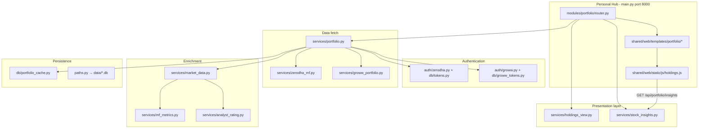

# Portfolio module — code flow

Personal Hub module at `/portfolio`: family holdings from **Zerodha (Kite)** and **Groww**, enriched with **Yahoo Finance**, rendered in Jinja + `holdings.js`, with optional **LLM portfolio agent**.

There are no Python classes in the classical OOP sense; behavior lives in **modules**, **route handlers**, and **plain functions**. This document maps each file and the end-to-end request flow.

---

## High-level architecture

---

## Request flows

### 1. Family dashboard (`GET /portfolio`)

| Step | Component | What happens |
|------|-----------|----------------|
| 1 | `router.portfolio_dashboard` | Parses `sort`, `order`, `group_by`, `refresh` |
| 2 | `router._family_holdings_view` | Calls `fetch_family_portfolio()` |
| 3 | `portfolio.fetch_family_portfolio` | Merges enabled Zerodha + Groww accounts; memory + SQLite cache |
| 4 | `holdings_view.prepare_holdings_view` | Aggregates by symbol, sorts/groups for UI |
| 5 | `holdings_view.holdings_financials_map` | JSON map for client account filters (AB/RB/SB/HB slices) |
| 6 | `dashboard.html` | Summary, broker status strip, filters, table or grouped view |
| 7 | `holdings.js` | Account/asset filters, pagination, group chart, row expander → insights API |

### 2. Zerodha login (`GET /auth/zerodha/{code}` → callback)

| Step | Component | What happens |
|------|-----------|----------------|
| 1 | `router.start_zerodha_login` | `zerodha.build_login_url` → Kite OAuth |
| 2 | User logs in at Zerodha | Redirect with `request_token` |
| 3 | `router.zerodha_callback` | `zerodha.complete_oauth` → `tokens.save_token` |
| 4 | `portfolio.invalidate_portfolio_cache` | Clears family/account caches |

Groww uses API keys / TOTP in `.env` (`auth/groww.py`), not OAuth.

### 3. Row expander — stock insights (`GET /api/portfolio/insights/{symbol}`)

| Step | Component | What happens |
|------|-----------|----------------|
| 1 | `holdings.js` `loadInsights` | Fetches JSON after row expand |
| 2 | `router.stock_insights` | `stock_insights.get_stock_insights` |
| 3 | `stock_insights` | Yahoo price history, TTM P/E, quarterly results, forecast, news (6h cache) |
| 4 | `holdings.js` | Renders Chart.js (price, 200 DMA, trailing P/E), tables |

### 4. Portfolio agent (`POST /api/portfolio/agent/ask/stream`)

| Step | Component | What happens |
|------|-----------|----------------|
| 1 | `portfolio_agent.stream_portfolio_agent` | SSE stream |
| 2 | `portfolio_context.build_portfolio_context` | Holdings + sectors + macro + `portfolio_profile` rules |
| 3 | OpenAI API | Streaming answer; threads in `agent_threads` + `portfolio_cache.db` |

### 5. Background revalidation

After a **stale** family snapshot is served, `portfolio_revalidate.schedule_family_revalidate` refetches in a thread and updates SQLite. Browser polls `/api/portfolio/meta`; `portfolio-revalidate.js` may reload the page.

---

## Module layout (`modules/portfolio/`)

### Root

| File | Role |
|------|------|
| `__init__.py` | Package docstring only |
| `router.py` | All FastAPI routes: UI, OAuth, JSON API, export, agent, insights |
| `config.py` | Account registry (AB/RB/SB/HB), `.env` credentials, broker resolution |
| `paths.py` | `DATA_DIR` → `modules/portfolio/data/` for SQLite files |
| `portfolio_profile.py` | Agent constraints: max % per stock/sector, growth themes, D/E cap |

### `auth/`

| File | Role |
|------|------|
| `zerodha.py` | Kite Connect: login URL, OAuth exchange, `get_kite_client()` |
| `groww.py` | Groww Trade API token (approval or TOTP), connection status |

### `db/`

| File | Role |
|------|------|
| `tokens.py` | Zerodha `access_token` per account; `token_needs_refresh` (6 AM IST next day) |
| `groww_tokens.py` | Groww access token storage |
| `portfolio_cache.py` | Family/account portfolio snapshots + agent thread messages |
| `weekly_history.py` | **Weekly history** — immutable week snapshots + position rows (`portfolio_history.db`) |

### `services/` — core logic

| File | Role |
|------|------|
| **`portfolio.py`** | **Orchestrator**: fetch holdings, normalize rows, `enrich_holdings`, summarize, family merge, in-memory + disk cache |
| **`holdings_view.py`** | Sort, group (cap/sector/account/signal/class), aggregate family rows, Excel export, `holdings_financials_map` |
| **`market_data.py`** | Yahoo: P/E, sector, cap, 52W, RSI, 200 DMA, analyst fields; `classify_sector`, `enrich_holdings` |
| **`mf_metrics.py`** | MF NAV history, 52W drawdown, NAV-based “signal” |
| **`analyst_rating.py`** | Maps Yahoo consensus / mean / upside → Strong buy … Strong sell |
| **`zerodha_mf.py`** | Kite `/mf/holdings` → normalized MF rows |
| **`groww_portfolio.py`** | Groww equity holdings + LTP |
| **`stock_insights.py`** | Expander payload: chart, results, forecast, news |
| **`portfolio_context.py`** | Builds JSON context for the LLM agent |
| **`portfolio_agent.py`** | Ask / stream agent using OpenAI |
| **`agent_threads.py`** | Persist chat threads in SQLite |
| **`portfolio_revalidate.py`** | Background refresh + meta for stale banner |
| **`macro_snapshot.py`** | Index-level context for agent (Nifty, etc.) |
| **`fx.py`** | USD/INR via Yahoo `INR=X` (Sarwa conversion) |
| **`weekly_recorder.py`** | Record family/account weekly snapshots; Sarwa manual import; Yahoo LTP refresh for current week |

---

## Holding record shape (normalized dict)

Produced by `portfolio.normalize_holding` / Groww / MF adapters, then enriched:

| Field | Source |
|-------|--------|
| `symbol`, `exchange`, `quantity`, `avg_price`, `last_price` | Broker |
| `invested`, `current_value`, `pnl`, `pnl_pct` | Computed |
| `market_cap`, `sector`, `pe_ratio`, `pct_from_52w_high`, `upside_pct` | Yahoo (`market_data`) |
| `rating_label`, `rating_slug`, `rating_rank` | `analyst_rating` |
| `asset_class` | `equity` or `mf` |
| `account_breakdown`, `account_codes` | Family aggregation (`holdings_view`) |

---

## UI layer (`shared/web/`)

### Templates (`templates/portfolio/`)

| Template | Role |
|----------|------|
| `dashboard.html` | Family page: header, summary, agent, holdings block |
| `account.html` | Single-account view (simpler toolbar) |
| `_broker_status_strip.html` | AB/RB/SB/HB connection pills (top right) |
| `_portfolio_summary.html` | Value / invested / P&L (maskable) |
| `_portfolio_filters_bar.html` | Account chips, equity/MF, search, group-by |
| `_holdings_controls.html` | Account page: asset filters + search + group-by |
| `_holdings_group_by_select.html` | Shared `<option>` list for group-by |
| `_holdings_table.html` | Flat or grouped wrapper, financials JSON script |
| `_holdings_grouped.html` | Overview bar chart + accordion groups |
| `_holding_row.html` | One table row + hidden detail row |
| `_holding_detail_sections.html` | Fund / Tech strips in expander |
| `_holding_account_breakdown.html` | Per-account qty/value when aggregated |
| `_rating_cell_compact.html` / `_rating_cell_detail.html` | Signal badge (table vs expander) |
| `_holdings_table_head.html`, `_holdings_colgroup.html` | Columns, sort links |
| `_portfolio_agent.html` | Chat UI |

### Frontend (`static/js/holdings.js`)

| Area | Behavior |
|------|----------|
| Filters | Account + asset class; recalculates summary, grouped chart, group cards, row values |
| Pagination | 50 rows per page (flat + nested tables) |
| Group chart | Chart.js horizontal bar; signal order B+→S+ fixed |
| Expander | Insights fetch, Chart.js price + P/E (fixed 0–100 axis) |
| Column resize | localStorage widths |

Supporting: `portfolio-revalidate.js`, `portfolio-summary.js`, `app.css`.

### Formatters (`shared/web/formatters.py`)

Jinja helpers: INR, %, cap/sector badges, sort URLs, `signal_short`, `account_column_compact`, etc.

---

## Configuration (`.env`)

| Pattern | Purpose |
|---------|---------|
| `ZERODHA_API_KEY_{ACCOUNT_ID}` | Kite Connect per Zerodha account (`id` from accounts.json) |
| `ZERODHA_API_SECRET_*` | OAuth secret |
| `GROWW_API_KEY_{ID}` / TOTP vars | Groww Trade API |
| `PORTFOLIO_CACHE_TTL_SECONDS` | Hot cache TTL (default 300s) |
| `OPENAI_API_KEY` | Portfolio agent |

Account codes are defined in `accounts.json` (e.g. **AB**, **RB**, **HB** Groww, **SW** Sarwa).

### Weekly history (`portfolio_history.db`)

Separate from live `portfolio_cache.db`. One snapshot per `(scope, account_id, week_start)` where `week_start` is the ISO **Monday** of that week.

| Scope | `account_id` | Meaning |
|-------|--------------|---------|
| `family` | `NULL` | All brokers merged |
| `account` | account `id` from JSON, `sarwa`, … | Per-account frozen holdings |

Each snapshot stores per-position: `quantity`, `avg_price`, `last_price`, `invested`, `current_value`, `pnl`, `pnl_pct`, sector, signal, etc.

| Behavior | Detail |
|----------|--------|
| Auto-record | After a **live** `fetch_family_portfolio` (broker APIs), if no snapshot exists for the current week |
| Sarwa | `POST /api/portfolio/sarwa/import` — JSON rows in USD → INR; replaces current week for `sarwa` |
| LTP refresh | **Current week only** — `refresh_current_week_ltps` via Yahoo; past weeks stay frozen |
| Sales inference | `GET /api/portfolio/weekly/compare` — qty drop vs previous week ⇒ `sold` |
| 52-week growth | `GET /api/portfolio/weekly/history?weeks=52` |

CLI: `python modules/portfolio/scripts/record_weekly_snapshots.py`, `refresh_snapshot_ltps.py`.

---

## Caching strategy

| Layer | TTL | Location |
|-------|-----|----------|
| Portfolio fetch | ~5 min (env) | Memory `_PORTFOLIO_CACHE` + `portfolio_cache.db` |
| Yahoo metrics per symbol | 6 h | `market_data._CACHE` |
| MF metrics | 6 h | `mf_metrics._MF_CACHE` |
| Stock insights | 6 h | `stock_insights._INSIGHTS_CACHE` |
| Zerodha token | Until ~6 AM IST next day | `tokens.db` |

`refresh=1` on URL bypasses hot cache and forces live broker fetch.

---

## Group-by modes (`holdings_view.group_holdings`)

| `group_by` | Bucket key |
|------------|------------|
| `cap` | Large / Mid / Small / ETF / MF |
| `sector` | `classify_sector()` label |
| `account` | Expanded per account (AB, RB, …) |
| `signal` | B+, B, H, S, S+, Unrated |
| `asset_class` | Equity vs Mutual funds |

Groups sort by **total value descending**, except **signal** (fixed B+→S+ order). Client-side filters recompute group totals without a round-trip.

---

## API surface (quick reference)

| Method | Path | Purpose |
|--------|------|---------|
| GET | `/portfolio` | Family dashboard HTML |
| GET | `/portfolio/account/{AB\|RB\|SB\|HB}` | Single-account HTML |
| GET | `/auth/zerodha/{code}` | Start OAuth |
| GET | `/auth/zerodha/callback` | OAuth callback |
| GET | `/api/portfolio` | Family JSON |
| GET | `/api/portfolio/{code}` | Account JSON |
| GET | `/api/status` | Broker connection status |
| GET | `/api/portfolio/insights/{symbol}` | Chart + fundamentals |
| GET | `/api/portfolio/export` | Family Excel |
| POST | `/api/portfolio/agent/ask/stream` | Agent SSE |

---

## Related docs

- `docs/groww-api-integration-plan.md` — Groww setup
- `run.md` — How to run the hub locally

---

## Recent cleanup (review pass)

- Removed unused templates: `_rating_cell.html`, `_account_filter_grid.html`
- Removed per-group pie `chart` / `chart_json` (only overview chart is used)
- Removed dead `rating_sort_key()` and duplicate `CACHE_TTL_SECONDS` alias
- DRY group-by options via `_holdings_group_by_select.html`
- Router: `_family_holdings_view()` helper, top-level Groww imports
